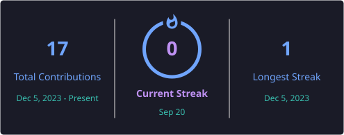

# Mustaqim Nurul Huda

 

 

## About

I'm Huda, an Electronic Engineering student at **PENS (Electronic Engineering Polytechnic Institute of Surabaya)**, based in Surabaya, Indonesia. I'm a self-learner in programming, currently building my skills in software development alongside my formal studies in electronics.

- 🎓 Studying Electronic Engineering at PENS
- 💻 Self-teaching programming & web development
- 🌱 Open to collaboration and feedback

 

## Stack

 

## Streak

 

## Connect

